# 🛡️ DeepFake & Synthetic Image Detection Web App

Dự án nghiên cứu và triển khai hệ thống phân loại ảnh thực (Real) và ảnh giả lập (Fake) từ các mô hình AI (GANs, Diffusion Models).Và nếu là ảnh giả sẽ nhận diện được do mô hình AI nào tạo ra. Ứng dụng kết hợp phân tích đa miền (Không gian & Tần số) và cung cấp khả năng giải thích mô hình thông qua XGrad-CAM.

## 🚀 Điểm nổi bật kỹ thuật (Technical Highlights)

* **Kiến trúc Dual-Stream:** Sử dụng đồng thời hai nhánh **EfficientNet-B3** (via `timm`) để trích xuất đặc trưng từ ảnh gốc (Spatial) và phổ tần số (FFT Magnitude).
* **Explainable AI (XAI):** Triển khai thuật toán **XGrad-CAM** để trực quan hóa các vùng "artifacts" mà mô hình tập trung vào để đưa ra quyết định.
* **Phân tích Pháp chứng (Digital Forensics):** Tích hợp bộ trích xuất đặc trưng chuyên sâu bao gồm:
    * **PRNU** (Photo Response Non-Uniformity) - Dấu vân tay cảm biến.
    * **Wavelet Transform** & **FFT Analysis** - Phân tích nhiễu tần số cao.
    * **GLCM** & **Local Binary Pattern** - Phân tích cấu trúc bề mặt (Texture).
* **Hỗ trợ đa dạng nguồn giả lập:** Nhận diện 10 loại ảnh fake từ StyleGAN (1, 2, 3), BigGAN, CycleGAN, Stable Diffusion, Latent Diffusion, v.v.

## 🛠️ Công nghệ sử dụng (Tech Stack)

* **Backend:** Python, Flask, Gunicorn.
* **Deep Learning:** PyTorch, Torchvision, TIMM (PyTorch Image Models).
* **Image Processing:** OpenCV, Scikit-image, Scipy, PyWavelets.
* **Visualization:** Matplotlib (Agg backend), XGrad-CAM.
* **Frontend:** HTML5, CSS3, JavaScript (AJAX/Fetch API).

## 🖼️ Demo & Kết quả thực nghiệm

### Giao diện hệ thống
Ứng dụng Web cho phép người dùng tải lên hình ảnh và nhận kết quả phân tích thời gian thực.
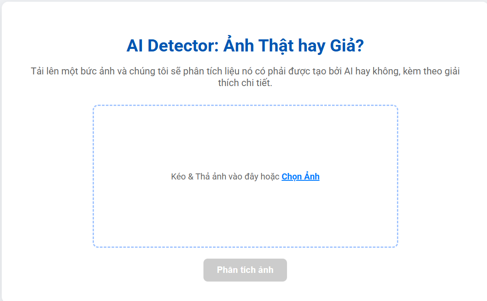
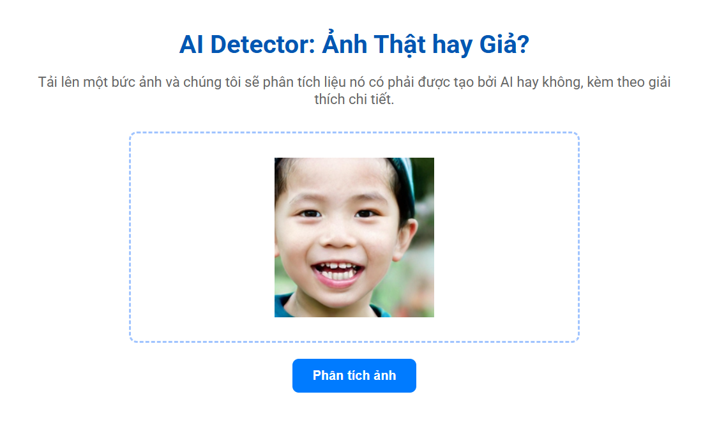
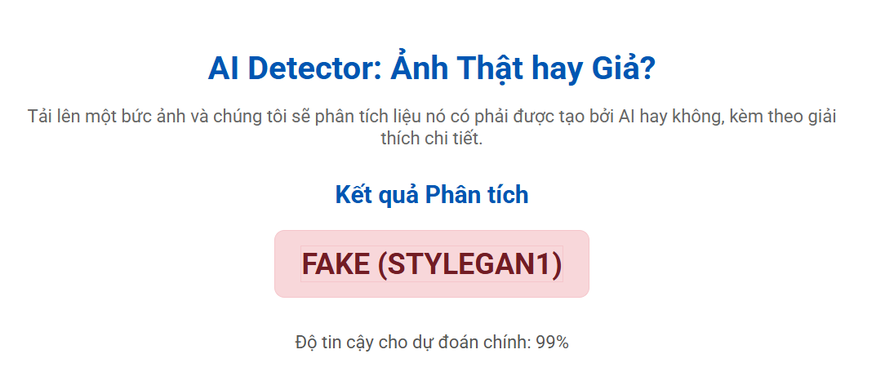
### Kết quả phân loại nguồn gốc
Dựa trên kiến trúc Dual-Branch, mô hình có khả năng phân loại chính xác nguồn gốc ảnh từ nhiều cấu trúc AI khác nhau.
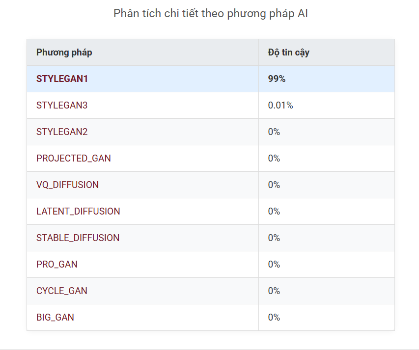
### Để tăng tính giải thích, ứng dụng hiển thị các phân tích đặc trưng bổ sung dựatrên các chỉ số đã tính toán trong mô hình và ý nghĩa của từng đặc trưng, tùy thuộc vào quá trình phân loại và biết được do mô hình AI
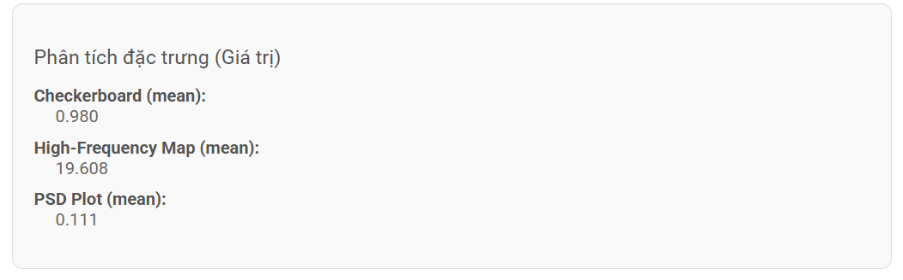
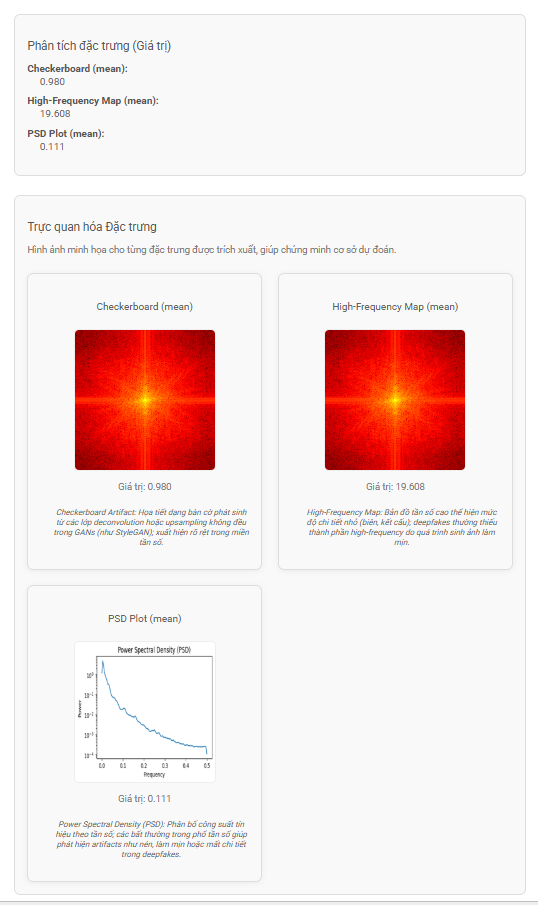
### Phân tích trực quan với XGrad-CAM
Hệ thống sử dụng phương pháp giải thích mô hình (Explainable AI) để làm nổi bật các vùng đặc trưng giúp nhận diện ảnh giả lập.
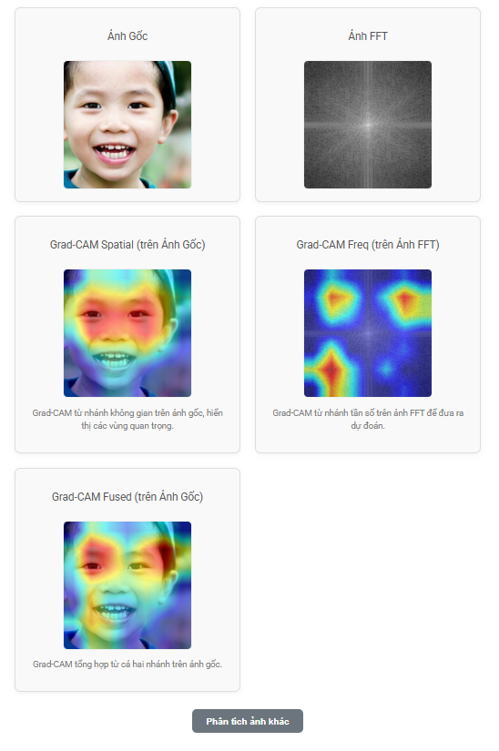

## Kết quả thực nghiệm
### Hiệu suất phân loại nhị phân của Dual-Stream EfficientNet-B3
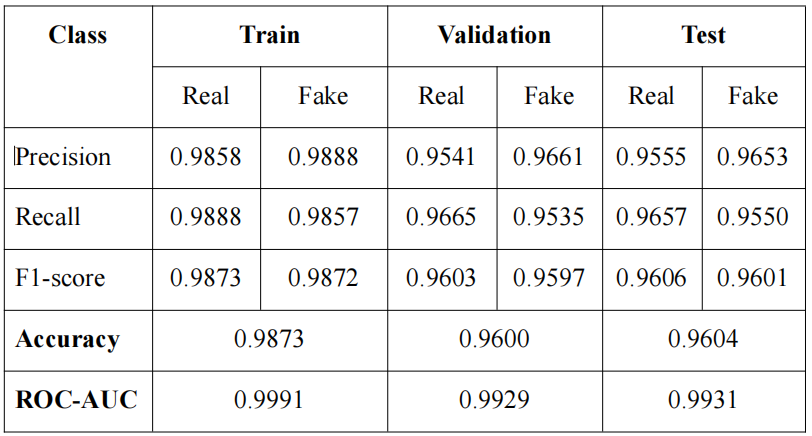

Kết quả thực nghiệm cho thấy mô hình EfficientNet-B3 đạt được hiệu suất rất cao trong bài toán phân loại nhị phân giữa ảnh Real và ảnh Fake. Cụ thể, trên tập Test, mô hình đạt Accuracy trung bình khoảng 96.04%, trong khi trên tập Train đạt 98.73% và Validation đạt 96.00%. Độ chênh lệch nhỏ giữa các tập dữ liệu (chỉ khoảng 2–3%) chứng tỏ mô hình có khả năng tổng quát hóa tốt, không bị hiện tượng overfitting.
### Hiệu suất phân loại đa lớp tập Train EfficientNet-B3
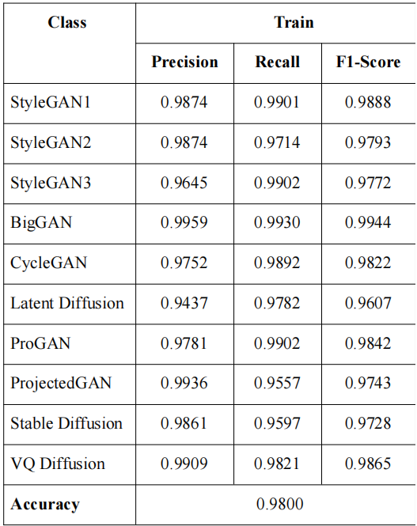

Kết quả cho thấy mô hình đạt Accuracy rất cao (≈98.00%), với Precision, Recall và F1 gần như tương đương nhau ở mức trung bình macro, phản ánh sự cân bằng tốt giữa 10 lớp. Đặc biệt, số lượng mẫu bị nhầm lẫn tổng (tổng FP + FN = 1.600) chỉ chiếm khoảng 2.00% tổng dữ liệu huấn luyện.
### Hiệu suất phân loại đa lớp tập Val EfficientNet-B3
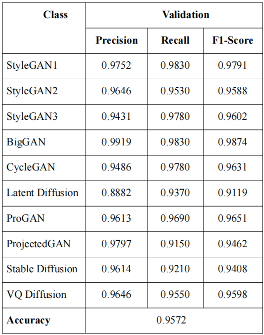

Kết quả cho thấy mô hình đạt độ chính xác cao (≈95.72%), với Precision, Recall và F1 gần như tương đương nhau ở mức trung bình macro, phản ánh sự cân bằng tốt
giữa 10 lớp. Chỉ số F1 cao chứng tỏ mô hình vừa chính xác trong việc nhận diện từng loại ảnh giả cụ thể, vừa ít bỏ sót các trường hợp khó phân biệt giữa các biến thể tương đồng.
### Hiệu suất phân loại đa lớp tập Test EfficientNet-B3
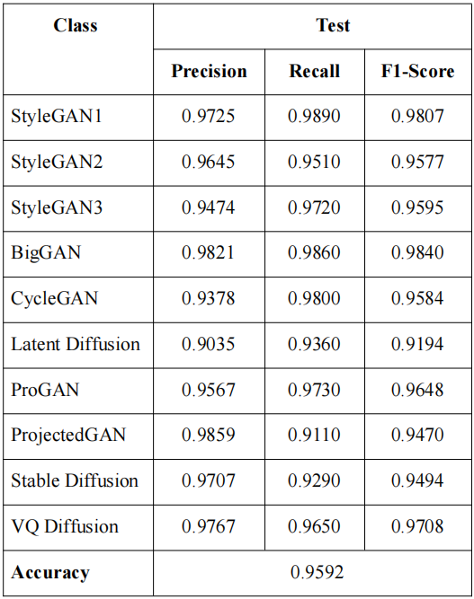

Kết quả cho thấy mô hình đạt độ chính xác cao (≈95.92%), với Precision, Recall và F1 gần như tương đương nhau ở mức trung bình macro, phản ánh sự cân bằng tốt
giữa 10 lớp. Đặc biệt, số lượng mẫu bị nhầm lẫn tổng (tổng FP + FN = 408) chỉ chiếm khoảng 4.08% tổng dữ liệu kiểm tra, cho thấy mô hình học được đặc trưng ổn định và đáng tin cậy nhờ compound scaling của EfficientNet-B3.
### Trực quan hóa tính năng và dấu vết số
## Đặc trưng PRNU
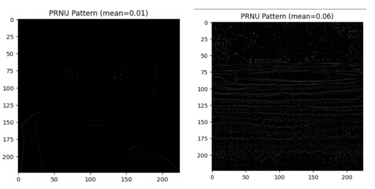

Đặc trưng PRNU (Photo Response Non-Uniformity) đóng vai trò như “dấu vân tay cảm biến” của mỗi thiết bị chụp ảnh. Đây là tín hiệu nhiễu ngẫu nhiên, nhưng ổn
định theo thời gian và riêng biệt cho từng cảm biến quang học, xuất hiện do sai số vi mô trong quá trình chế tạo sensor. Vì vậy, ảnh thật chụp từ camera thực tế luôn chứa một mẫu nhiễu PRNU đặc trưng, trong khi ảnh được tạo sinh bởi AI thiếu dấu hiệu vật lý này, do quá trình tổng hợp ảnh của chúng chỉ là mô phỏng số
## Đặc trưng PSD
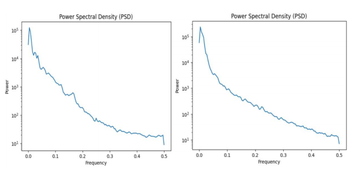

Trong miền tần số, mỗi hình ảnh có thể được đặc trưng thông qua phổ mật độ công suất (Power Spectral Density – PSD), phản ánh cách năng lượng của tín hiệu
được phân bố trên các dải tần khác nhau. Đối với ảnh thật, năng lượng thường phân tán rộng hơn do sự hiện diện của các chi tiết ngẫu nhiên và nhiễu vật lý từ cảm biến. Ngược lại, ảnh được tạo sinh bởi AI (đặc biệt là các mô hình GAN) thường thể hiện phân bố năng lượng bị nén về vùng tần số thấp, do quá trình sinh ảnh mang tính “làm mịn” và thiếu nhiễu ngẫu nhiên tự nhiên.
## Đặc trưng Wavelet
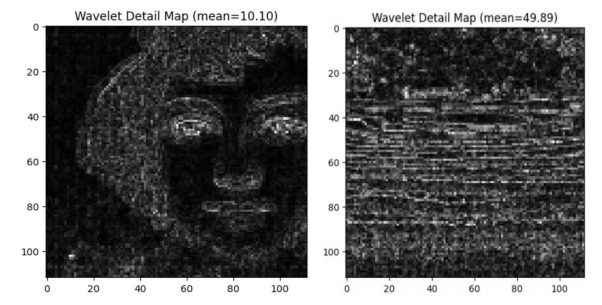

Phép biến đổi sóng con rời rạc (Discrete Wavelet Transform – DWT) cho phép phân tách ảnh thành các thành phần chi tiết ở nhiều thang tần khác nhau (multi-scale
decomposition). Trong đó, bản đồ chi tiết (Wavelet Detail Map) biểu diễn năng lượng của các thành phần biên và texture trong ảnh. Đối với ảnh thật, năng lượng sóng con thường cao hơn do chứa nhiều chi tiết tự nhiên, cạnh sắc nét và nhiễu cảm biến vật lý.
## 📁 Tài nguyên dự án (Project Resources)
* **Model Weights:** [Tải file checkpoint_epoch_eff.pth tại đây](https://drive.google.com/file/d/1jey48XBsVM5ETkW4nfVAw8evInzsTkKH/view?usp=drive_link)

## 📁 Cấu trúc thư mục

```text
├── app/               # Logic xử lý chính
├── models/            # Chứa checkpoint .pth (Xem hướng dẫn tải bên dưới)
├── static/            # CSS, JS và ảnh giao diện
├── templates/         # Giao diện HTML (index.html)
├── app.py             # File khởi chạy Flask server
├── Procfile           # Cấu hình cho deployment (Heroku/Render)
└── requirements.txt   # Danh sách thư viện cần thiết


